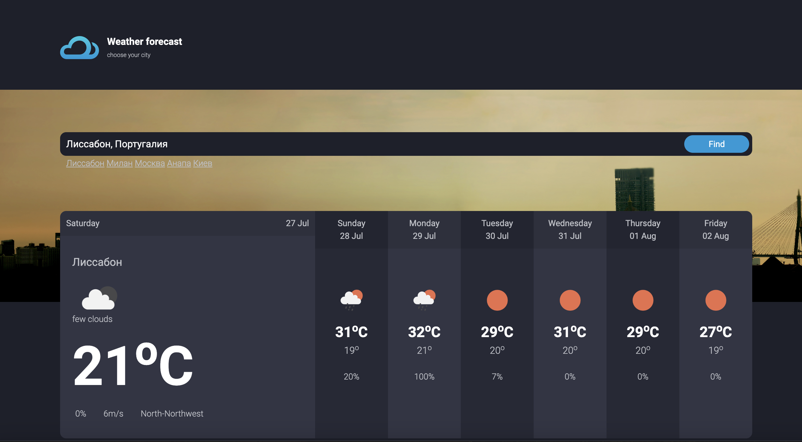

# Прогноз погоды Web-приложение

## Описание

Это веб-приложение для прогноза погоды, которое позволяет пользователю ввести название города и получить текущий прогноз погоды в этом городе. Приложение использует Django + DRF как веб-фреймворки и API от OpenWeatherMap для получения данных о погоде. Django рендерит галвную страницу.html дальше работает JS, который дергает API DRF на получение прогноза погоды и обновления части страницы с прогнозом.

## Функциональные возможности

- Ввод названия города для получения прогноза погоды. Написан API который отвечает на запросы JS и отдает прогноз по локации.
- Подсказки при вводе города с помощью Google.
- Отображение прогноза погоды в удобочитаемом формате.
- Сохранение последнего запрашиваемого города в сессии и отображение погоды при повторном посещении.
- История поиска последних 5 городов сохраняется в сессиях.



## Установка

### Системные требования

- Docker
- Docker Compose

### Клонирование репозитория

```bash
git clone https://github.com/Stavickiy/weather_project
cd weather_project
```
### Создайте файл .env на основе файла .env.example:
```bash
cp .env.example .env
```
### Запустите контейнеры:
```bash
docker-compose up --build
```
### После запуска приложения откройте браузер и перейдите по адресу http://localhost:8000.

## Технологии
- Django: Веб-фреймворк для создания веб-приложений.
- DRF: Написан API который отвечает на запросы JS и отдает прогноз по локации.
- PostgreSQL: СУБД для хранения данных.
- Docker: Контейнеризация приложения.
- OpenWeatherMap API: Для получения данных о погоде.
- Google Places API: Для автодополнения городов.

## Разработчики
- [Евгений Ставицкий](https://t.me/Eugenius71991)